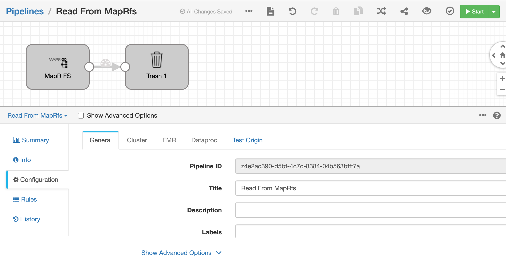
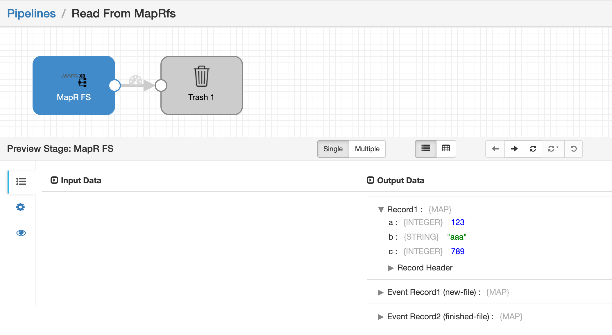
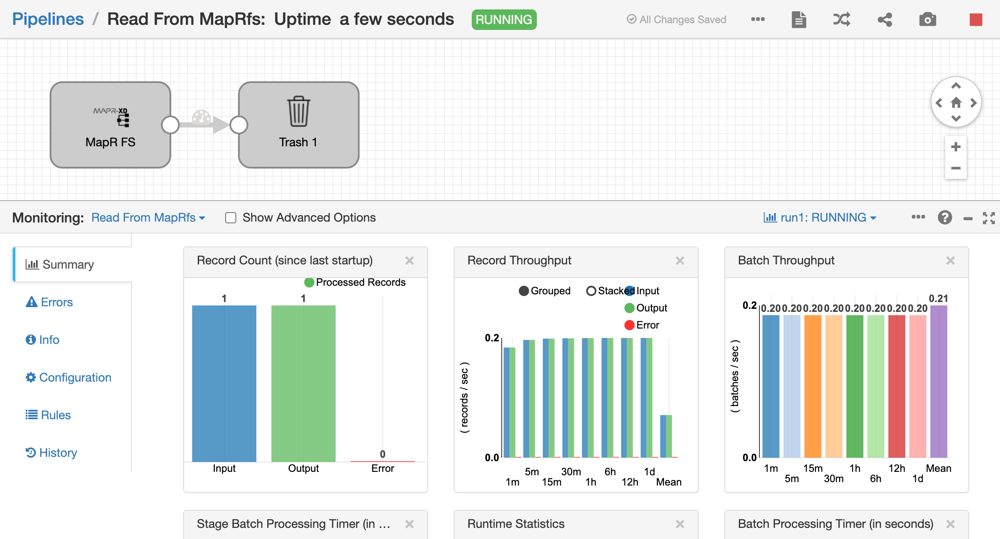

## sdc-mapr-k8s

This project builds a custom Docker image of StreamSets Data Collector (SDC)
on Ubuntu 16.04 including MapR v6.1 client and Kubernetes deployment support.

####   Configure and Build the Image

Switch to the <code>sdc-mapr-docker</code> directory.

Edit <code>build.sh</code> and make these changes:

* Set the image name

* Edit the list of stage libraries set in the <code>SDC_STAGE_LIBS</code> env var.  Make sure to include the <code>streamsets-datacollector-mapr_6_1-lib</code>  and <code>streamsets-datacollector-mapr_6_1-mep6-lib</code> stage libs. I've included the <code> streamsets-datacollector-jython_2_7-lib</code> library as an example.

* Edit the list of Enterprise stage libraries set in the <code>SDC_ENTERPRISE_STAGE_LIBS</code> env var.  I've included the <code>streamsets-datacollector-snowflake-lib-1.5.0</code> as an example.

Execute the <code>build.sh</code> script to build the image and push it to DockerHub.

####   Create Kubernetes Secrets for a MapR Service Ticket and Truststore

Generate or obtain a "long lived" MapR service ticket and place it in the <code>sdc-mapr-k8s/resources</code> directory (not in the similarly named <code>Resources</code> directory in the <code>sdc-mapr-docker</code> directory).  The file should have the name <code>longlived_ticket</code>.

Execute the script <code>create-mapr-ticket-secret.sh</code> to create a Secret for the ticket.

If you are connecting to a cluster that was deployed with self-signed certs, place a MapR <code>ssl_truststore</code> file in the <code>sdc-mapr-k8s/resources</code> directory.

Execute the script <code>create-mapr-truststore-secret.sh</code> to create a Secret for the Truststore.

#### Set Deployment Properties

Edit the file <code>sdc-mapr-dep.yaml</code> and set the <code>MAPR_CLIENT_CONFIG</code> environment variable with the value needed to configure the MapR client for the target cluster.  The value is passed to the <code>/opt/mapr/server/configure.sh</code> command when the Container starts up.  For example, in my environment I use the string <code>"-N mark.mapr -c -secure -C 10.10.60.182:7222"</code>.

Also set a value for the <code>SDC_CONF_SDC_BASE_HTTP_URL</code> environment variable for Control Hub based deployment

#### Launch the Deployment

Launch the Deployment with Control Hub and Control Agent, using the <code>sdc-mapr-dep.yaml</code>. A <code>sdc-mapr-svc.yaml</code> is included for a NodePort Service if needed..

#### Run a Pipeline

If all goes well you should be able to reach the newly deployed SDC's UI.  No additional steps are needed to authenticate to MapR as the MapR client is initialized and the service ticket is in the expected location.

Create a pipeline that reads from MapRfs as a test, like this:

Set the MapRfs configuration directory to <code>/opt/mapr/hadoop/hadoop-2.7.0/etc/hadoop</code>:

Preview the pipeline to inspect the data being read:

Run the pipeline:

